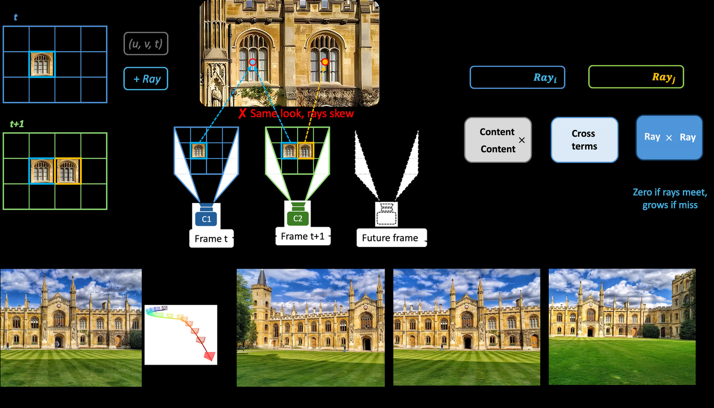

# SCoPE for Wan2.2-I2V-A14B

SCoPE generates camera-controlled videos from a first frame, a text prompt, and a camera
trajectory. It represents each video token with both its spatial-temporal position and its camera
sightline, enabling direct control over camera motion in Wan2.2-I2V-A14B.



## Download

```bash
pip install -U huggingface_hub
hf download TencentARC/SCoPE --local-dir checkpoints/SCoPE
```

The model repository is self-contained for inference; a separate Wan2.2 model download is not
required.

## Usage

Install the SCoPE code:

```bash
git clone https://github.com/TencentARC/SCoPE.git
cd SCoPE
pip install -e .
```

Generate a video with an example camera trajectory:

```bash
python inference.py \
  --model_path checkpoints/SCoPE \
  --case omni-misty-forest \
  --trajectory truck_right \
  --output_path outputs/omni-misty-forest.mp4
```

For custom inputs:

```bash
python inference.py \
  --model_path checkpoints/SCoPE \
  --input_image path/to/first_frame.png \
  --prompt "A person walks along a misty forest trail." \
  --camera_path path/to/camera_poses.npy \
  --x_fov 1.11847 \
  --output_path outputs/custom.mp4
```

Camera poses use OpenCV camera-to-world coordinates and must have shape `[81, 3, 4]` or
`[81, 4, 4]`. `x_fov` is the horizontal field of view in radians; pinhole cameras use `xi=0`.

## Training data

SCoPE is trained with RealEstate10K, DL3DV, PanShot, and OmniWorld. The datasets use a common
camera protocol: poses are expressed relative to the first camera and translation is normalized
with per-clip near depth. Users are responsible for following the licenses and terms of the
corresponding datasets.

## Intended use and limitations

This model is intended for research on image-to-video generation and controllable camera motion.
It inherits the visual capabilities, biases, safety limitations, and computational requirements of
Wan2.2. Results may degrade for inaccurate camera poses or intrinsics, trajectories far outside
the training distribution, large occlusions, or unusually fast camera motion.

## Citation

```bibtex
@article{yin2026scope,
  title={SCoPE: Sightline-Coordinate Positional Encoding for Video Diffusion Transformers},
  author={Yin, Minghao and Lu, Jiahao and Hu, Wenbo and Zhao, Wang and Shan, Ying and Han, Kai},
  year={2026}
}
```
