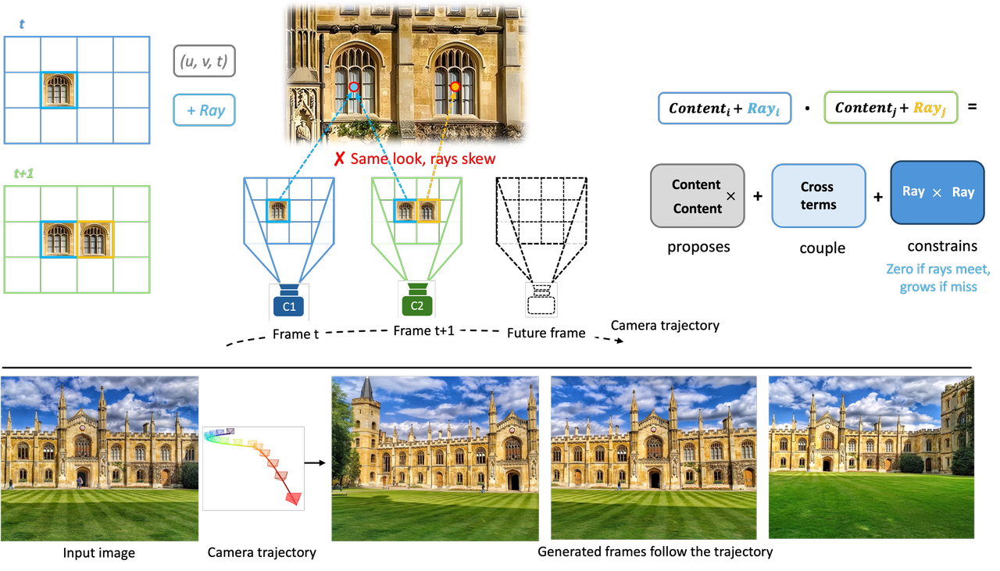
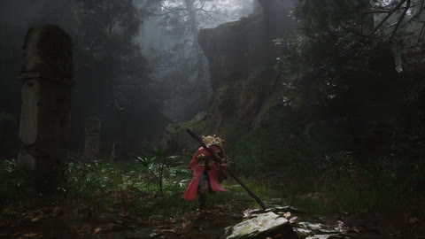
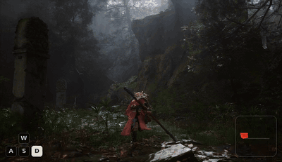
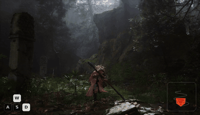
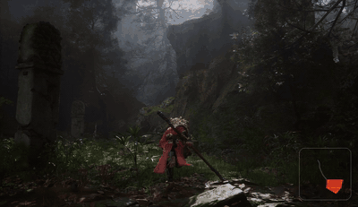
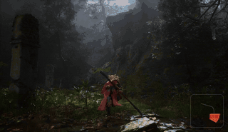
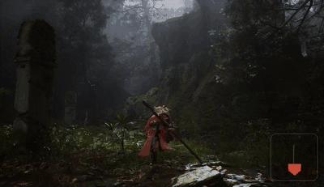

<div align="center">

# SCoPE: Sightline-Coordinate Positional Encoding for Video Diffusion Transformers

Minghao Yin · Jiahao Lu · Wenbo Hu · Wang Zhao · Ying Shan · Kai Han

[](https://visual-ai.github.io/scope/)
[](https://arxiv.org/abs/2606.27345)
[](https://github.com/TencentARC/SCoPE)
[](https://huggingface.co/TencentARC/SCoPE)
[](LICENSE.txt)



</div>

SCoPE adds camera sightlines as positional coordinates to a pretrained video diffusion
transformer. Given a first frame, a text prompt, and a camera trajectory, it generates a video
that follows the requested camera motion while preserving the original image-to-video prior.

## 📑 Table of Contents

- [Overview](#overview)
- [Repository structure](#repository-structure)
- [Installation](#installation)
- [Model download](#model-download)
- [Inference](#inference)
  - [Quick start — one trajectory](#quick-start--one-trajectory)
  - [Custom image and trajectory](#custom-image-and-trajectory)
  - [All trajectories for one scene](#all-trajectories-for-one-scene)
  - [Visualizing camera control](#visualizing-camera-control)
  - [Inference options](#inference-options)
- [Training](#training)
- [Citation](#citation)
- [Acknowledgements](#acknowledgements)
- [License](#license)

## Overview

Video diffusion transformers address their tokens by position on the pixel-time grid: an address
in the tensor, not in the world. The world point a token depicts lies on a surface that has not
been generated yet, but its camera ray is fixed the moment the user specifies a trajectory. SCoPE
therefore treats the ray as a **second positional coordinate**, so camera control becomes a
property of the coordinate system rather than an added module.

The ray is added to the pretrained attention's queries and keys, and the score gains a term that
reads the two rays alone; its canonical form — the reciprocal product of line geometry — measures
how nearly two lines of sight meet. A **Normalize-Gate-Inject** scheme makes a single encoding
trainable across both metric and up-to-scale pose sources. The retrofit keeps RoPE bit-exact,
starts from the unchanged pretrained DiT, and adds under 0.1% new parameters.

In practice this means:

- **Camera motion as coordinates.** Each video token is tied to its camera ray via Plücker
  coordinates; no separate control branch is trained.
- **Robust to heterogeneous pose sources.** The per-clip near-depth normalization plus the learned
  scale gate let SCoPE consume poses from different reconstruction pipelines and scene scales.
- **Self-contained Wan2.2-I2V-A14B release.** The model repository contains everything required for
  inference; users do not need to download a second Wan2.2 checkpoint.

## Repository structure

| Path | Description |
| --- | --- |
| `inference.py` | Inference entry: single, custom, or all-trajectory generation. |
| `train.py` | Training entry for the RDPO high-only recipe. |
| `scope/encoding.py` | Sightline-Coordinate positional encoding (Normalize-Gate-Inject). |
| `scope/geometry.py` | Camera-ray and Plücker-coordinate utilities. |
| `scope/camera.py` | Converts camera trajectories into SCoPE coordinates. |
| `scope/modeling.py` | Wan self-attention augmented with the SCoPE encoding. |
| `scope/patch.py` | Installs SCoPE attention into both Wan2.2-A14B experts. |
| `scope/pipeline.py` | Wan2.2-A14B inference pipeline with camera conditioning. |
| `scope/weights.py` | Loads the complete SCoPE model from sharded weights. |
| `scope/config.py` | Inference defaults matching the released checkpoint. |
| `scope/training.py` | Config-driven RDPO high-only training loop. |
| `scope/data/` | Four native dataset loaders + the shared pose convention. |
| `configs/` | Training YAML and the default negative prompt. |
| `scripts/` | `overlay_camera.py`, `estimate_near_depth.py`, `build_omniworld_index.py`, `train.sh`, `inference.sh`. |
| `examples/` | `manifest.json`, example first frames, and camera trajectories. |
| `assets/` | Teaser image and demo GIFs. |
| `diffsynth/` | Vendored DiffSynth code required by inference. |
| `tests/` | Unit tests. |

## Installation

SCoPE requires Python 3.11 and a CUDA-capable GPU. The released weights were trained and
evaluated with **PyTorch 2.9.1 (CUDA 12.8)**; because changing the PyTorch version can change the
numerical output, we recommend reproducing this exact environment.

Recommended — [uv](https://docs.astral.sh/uv/) (resolves the pinned CUDA 12.8 torch build):

```bash
git clone https://github.com/TencentARC/SCoPE.git
cd SCoPE
uv sync
source .venv/bin/activate
```

Alternative — pip with the PyTorch CUDA 12.8 wheel index:

```bash
conda create -n scope python=3.11 -y
conda activate scope
pip install -e . --extra-index-url https://download.pytorch.org/whl/cu128
```

Optional extras:

- `pip install -e .[viz]` installs matplotlib, needed by the camera-control overlay tool
  `scripts/overlay_camera.py`.
- FlashAttention is optional; the code falls back to PyTorch SDPA when it is not available.

## Model download

Download the SCoPE model from Hugging Face:

```bash
pip install -U huggingface_hub
hf download TencentARC/SCoPE --local-dir checkpoints/SCoPE
```

The checkpoint is approximately 67 GB. Keep both the checkpoint and the Hugging Face cache on
local storage.

## Inference

All inference is driven by `inference.py`. The repository ships example first frames, prompts, and
camera trajectories under `examples/`, so every command below runs out of the box. See
[Inference options](#inference-options) for the full flag list.

### Quick start — one trajectory

**Input:** one first frame + one camera trajectory (+ the scene prompt).
**Output:** one 81-frame video that follows the trajectory (480 × 832, seed 42).

```bash
python inference.py \
  --model_path checkpoints/SCoPE \
  --case omni-misty-forest \
  --trajectory truck_right \
  --output_path outputs/omni-misty-forest__truck_right.mp4
```

| Input first frame | Output (`truck_right`) |
| :---: | :---: |
|  |  |

The output is shown with the camera-control HUD overlay (see
[Visualizing camera control](#visualizing-camera-control)); the bottom-right inset traces the
driving camera path. `bash scripts/inference.sh` wraps this command.

### Custom image and trajectory

**Input:** your own first frame, prompt, OpenCV camera-to-world poses, and horizontal FOV.
**Output:** one video following your trajectory.

```bash
python inference.py \
  --model_path checkpoints/SCoPE \
  --input_image path/to/first_frame.png \
  --prompt "A person walks along a misty forest trail." \
  --camera_path path/to/camera_poses.npy \
  --x_fov 1.11847 \
  --output_path outputs/custom.mp4
```

`camera_poses.npy` must have shape `[81, 3, 4]` or `[81, 4, 4]` and use OpenCV camera-to-world
coordinates. `x_fov` is the horizontal field of view in radians. Pinhole cameras use the default
`xi=0`; unified camera models can set `--xi` explicitly.

### All trajectories for one scene

**Input:** one first frame + every trajectory bundled for that scene.
**Output:** a series of videos (one per trajectory), generated with a single model load.

```bash
python inference.py \
  --model_path checkpoints/SCoPE \
  --case omni-misty-forest \
  --all_trajectories \
  --output_dir outputs/omni-misty-forest
```

The same first frame driven by all five bundled trajectories. `truck_right` and `snake_fwd` are
synthetic camera paths; **GT 1–3** are the scene's own recorded OmniWorld camera paths (use their
`--trajectory` ids to reproduce them).

| | | |
| :---: | :---: | :---: |
| **Input first frame** | **`truck_right`** | **`snake_fwd`** |
|  |  |  |
| **GT 1** · `real_split0_000041` | **GT 2** · `real_split0_000081` | **GT 3** · `real_split0_000161` |
|  |  |  |

Existing MP4 files are skipped, so interrupted runs can be resumed with the same command.

### Visualizing camera control

**Input:** a generated video + the camera trajectory used to produce it.
**Output:** the same video with a camera-frustum HUD (and optional WASD keys) composited in.

`scripts/overlay_camera.py` derives the overlay from the pose: it renders the accumulated camera
frustum in the bottom-right corner and, for keyboard-style trajectories, the active WASD keys in
the bottom-left corner. Every demo video in this README was produced with this tool.

```bash
# Camera-frustum HUD only (recommended for scenic / dolly / orbit motions):
python scripts/overlay_camera.py outputs/omni-misty-forest__truck_right.mp4 \
  --pose examples/poses/omni-misty-forest/truck_right.npy \
  --out_dir outputs/overlay --hide_wasd

# Add the WASD key indicator (for keyboard-style / drone trajectories):
python scripts/overlay_camera.py outputs/clip.mp4 --pose path/to/pose.npy --out_dir outputs/overlay
```

Requires the `viz` extra (`pip install -e .[viz]`) and `ffmpeg` on `PATH`.

### Inference options

| Option | Default | Description |
| --- | --- | --- |
| `--model_path` | `TencentARC/SCoPE` | Local path or Hugging Face id of the SCoPE model. |
| `--manifest` | `examples/manifest.json` | Example manifest for `--case` / `--trajectory`. |
| `--case` | first case | Example case id to generate. |
| `--trajectory` | first trajectory | Trajectory id within the case. |
| `--all_trajectories` | off | Generate every trajectory of `--case` (uses `--output_dir`). |
| `--input_image` | – | Custom first frame (with `--prompt`, `--camera_path`, `--x_fov`). |
| `--prompt` | – | Custom text prompt. |
| `--camera_path` | – | Custom pose `.npy`, `[81,3,4]`/`[81,4,4]` OpenCV c2w. |
| `--x_fov` | – | Horizontal field of view in radians (custom inputs). |
| `--xi` | `0.0` | Unified-camera distortion parameter. |
| `--output_path` | `outputs/sample.mp4` | Output file for a single generation. |
| `--output_dir` | `outputs` | Output directory for `--all_trajectories`. |
| `--overwrite` | off | Regenerate existing outputs (`--all_trajectories`). |
| `--negative_prompt` | `configs/negative_prompt.txt` | Negative prompt file. |
| `--seed` | `42` | Random seed. |
| `--cache_dir` | – | Hugging Face cache directory. |
| `--vram_limit_gb` | – | VRAM budget for offloading (enables VRAM management). |

## Training

The public training entry reproduces the RDPO high-noise recipe used for SCoPE: only the
high-noise expert is optimized, and training timesteps are sampled from `[0.9, 1.0)`. The released
mixture concatenates four datasets — RealEstate10K, DL3DV, PanShot, and OmniWorld — each read by
its own native loader in `scope/data/`.

A run is described by a single YAML config:

```bash
python train.py --config configs/train_rdpo_high_only.yaml --num_gpus 8
```

`scripts/train.sh` wraps this command. Multi-GPU training uses FSDP automatically; the model is
large, so multi-GPU training is strongly recommended.

### Training options

| Option | Default | Description |
| --- | --- | --- |
| `--config` | `configs/train_rdpo_high_only.yaml` | Training YAML (data mixture, trainer, optimizer). |
| `--model_path` | from config | Override the config `model_path`. |
| `--output_dir` | from config | Override the checkpoint/output directory. |
| `--num_gpus` | from config (`8`) | Override GPU count; `>1` enables FSDP full-shard. |
| `--max_steps` | from config (`10000`) | Override the number of training steps. |
| `--resume_from_checkpoint` | – | Resume from an existing checkpoint. |

### Camera convention

Every dataset is normalized with the same convention as RealEstate10K:

1. Poses are OpenCV camera-to-world matrices, expressed **relative to the first camera** (the
   first frame becomes the identity pose).
2. Translation is preprocessed by `trajectory_scale / near_depth`, where `near_depth` is a
   per-clip near-distance depth estimate. This normalization only makes the translation magnitude
   comparable across datasets — absolute scale is handled inside the model by the learned scale
   gate, so `trajectory_scale` stays `1.0` for all datasets.

### Data preparation

Point the config at your local dataset roots, then precompute the per-clip `near_depth` for each
dataset with the shared estimator (RAFT optical flow + two-view triangulation):

```bash
# OmniWorld first needs a validity index over its training windows:
python scripts/build_omniworld_index.py --data_root /path/to/OmniWorld \
  --output /path/to/OmniWorld/valid_entries.json

# Estimate per-clip near-depth for each dataset (repeat per dataset):
python scripts/estimate_near_depth.py --dataset realestate10k \
  --data_root /path/to/RealEstate10K --split train \
  --output /path/to/RealEstate10K/near_depth_train.json
```

The same `estimate_near_depth.py` handles all four datasets via `--dataset {realestate10k,dl3dv,
panshot,omniworld}`. See `configs/train_rdpo_high_only.yaml` for the full list of per-dataset
paths and options (`sample_stride` is random ≤4 for RealEstate10K and 1 for the others).

## Citation

```bibtex
@article{yin2026scope,
  title={SCoPE: Sightline-Coordinate Positional Encoding for Video Diffusion Transformers},
  author={Yin, Minghao and Lu, Jiahao and Hu, Wenbo and Zhao, Wang and Shan, Ying and Han, Kai},
  year={2026}
}
```

## Acknowledgements

SCoPE is built on [Wan2.2](https://github.com/Wan-Video/Wan2.2) and
[DiffSynth-Studio](https://github.com/modelscope/DiffSynth-Studio). We thank the authors and
contributors of these projects.

## License

SCoPE is released under the [Apache-2.0 License](LICENSE.txt).
